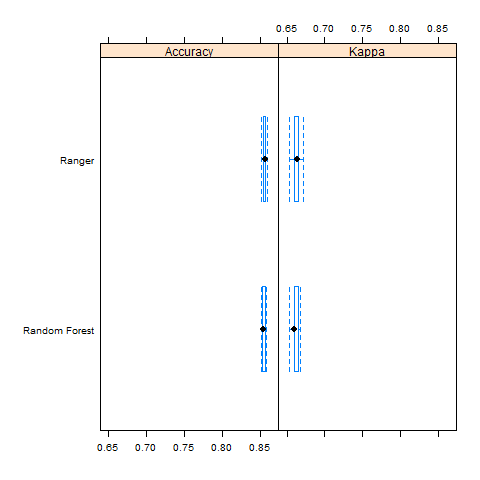

---
title: "Midterm Presentation"
author: <font size="5"> Jarrod Dube </font>
output:
  xaringan::moon_reader:
    css: [default, metropolis, metropolis-fonts]
    lib_dir: libs
    nature:
      highlightStyle: github
      highlightLines: true
      countIncrementalSlides: false
      slideNumberFormat: |
        <div class="progress-bar-container">
          <div class="progress-bar" style="width: calc(%current% / %total% * 100%);">
          </div>
        </div>`
---

<style>

.remark-slide-content {
  background-color: #FFFFFF;
  border-top: 80px solid #F9C389;
  font-size: 17px;
  font-weight: 300;
  line-height: 1.5;
  padding: 1em 2em 1em 2em
}

.inverse {
  background-color: #696767;
  border-top: 80px solid #696767;
  text-shadow: none;
  background-image: url(https://github.com/goodekat/presentations/blob/master/2019-isugg-gganimate-spooky/figures/spider.png?raw=true);
	background-position: 50% 75%;
  background-size: 150px;
}

.your-turn{
  background-color: #8C7E95;
  border-top: 80px solid #F9C389;
  text-shadow: none;
  background-image: url(https://github.com/goodekat/presentations/blob/master/2019-isugg-gganimate-spooky/figures/spider.png?raw=true);
	background-position: 95% 90%;
  background-size: 75px;
}

.title-slide {
  background-color: #F9C389;
  border-top: 80px solid #F9C389;
  background-image: none;
}

.title-slide > h1  {
  color: #111111;
  font-size: 40px;
  text-shadow: none;
  font-weight: 400;
  text-align: left;
  margin-left: 15px;
  padding-top: 80px;
}
.title-slide > h2  {
  margin-top: -25px;
  padding-bottom: -20px;
  color: #111111;
  text-shadow: none;
  font-weight: 300;
  font-size: 35px;
  text-align: left;
  margin-left: 15px;
}
.title-slide > h3  {
  color: #111111;
  text-shadow: none;
  font-weight: 300;
  font-size: 25px;
  text-align: left;
  margin-left: 15px;
  margin-bottom: -30px;
}

</style>

```{css, echo=FALSE}
.left-code {
  color: #777;
  width: 48%;
  height: 92%;
  float: left;
}
.right-plot {
  width: 51%;
  float: right;
  padding-left: 1%;
}
```

```{r setup, include = FALSE}

# R markdown options
knitr::opts_chunk$set(echo = TRUE, 
                      
                      fig.width = 10,
                      fig.height = 5,
                      fig.align = "center", 
                      message = FALSE,
                      warning = FALSE)

# Load packages
library(tidyverse)
library(ggplot2)
library(knitr)
library(gganimate)
library(gifski)
```

# Part 2 - 1

.left-code[
```{r step1, eval=FALSE}
df = read_csv("midterm.csv")
df = df %>% select(-payfix, -raceethn, -admtype, -asource, -preopday, -bwght, -ecodub92, -pt_state, -diag_adm, -er_mode, -obs_hour, -nicu_day)
df$season = case_when(df$moa < 3 ~ 'Winter',
                      df$moa < 6 ~ 'Spring',
                      df$moa < 9 ~ 'Summer',
                      df$moa < 12 ~ 'Fall',
                      TRUE ~ 'Winter')
df$sex = case_when(df$sex == 1 ~ 'Male',
                   df$sex == 2 ~ 'Female',
                   TRUE ~ 'Unknown')

df %>% ggplot() + geom_point(mapping=aes(x=age, y=los)) + facet_wrap(~sex) +
  labs(x='Age', 
       y = 'Length of Stay', 
       title = 'Length of Stay by Age and Sex', 
       caption = 'Younger people of both genders seem to generally have longer 
       stays than older people. Plots are similar between the two genders.')
```
]
.right-plot[
```{r, ref.label = "step1", echo = FALSE, fig.height = 6, fig.width = 7}
```
]

---
# Part 2 - 2

.left-code[
```{r step2, eval=FALSE}
df %>% ggplot() + geom_point(mapping=aes(x=los, y=tot)) + facet_wrap(~provider) +
  labs(x='Length of Stay', 
       y = 'Total Charge', 
       title = 'Total Charge by Length of Stay and Provider', 
       caption = 'Total charge increases as length of stay increases.
       Providers 7205 and 7214 generally have the most patients and highest total charges')
```
]
.right-plot[
```{r, ref.label = "step2", echo = FALSE, fig.height = 6, fig.width = 7}
```
]

---
# Part 2 - 3

.left-code[
```{r step3, eval=FALSE}
df %>% ggplot() + geom_bar(mapping=aes(x=sex, fill=season), position = 'dodge') +
  labs(x='Sex', 
       y='Count',
       fill = 'Season', 
       title = 'Count of Sex By Season', 
       caption = 'All seasons admit around the same amount of patients, but spring
       admits the most. More female patients admitted than male.')
```
]
.right-plot[
```{r, ref.label = "step3", echo = FALSE, fig.height = 6, fig.width = 7}
```
]

---
# Part 2 - 4

.left-code[
```{r step4, eval=FALSE}
df %>% ggplot() + geom_bar(mapping=aes(x=age, fill=season), position = 'fill') +
  labs(x='Age', 
       y='Percent',
       fill = 'Season', 
       title = 'Percent of Age Per Season', 
       caption = 'Generally all ages have similar admission levels per season, but
       summer seems to have lower admission levels for lower ages and higher numbers
       for older patients.')
```
]
.right-plot[
```{r, ref.label = "step4", echo = FALSE, fig.height = 6, fig.width = 7}
```
]

---
# Part 2 - 5

.left-code[
```{r step5, eval=FALSE}
df %>% group_by(moa) %>% summarise(average_age=mean(age)) %>% 
  ggplot() + geom_col(mapping=aes(x=moa, y=average_age)) + 
  labs(x='Month of Admission', 
       y='Average Age',
       title = 'Average Age Per Month of Admission', 
       caption = 'All months have an average age between 50 and 55.
       There must not be much variation in average age overall.')
```
]
.right-plot[
```{r, ref.label = "step5", echo = FALSE, fig.height = 6, fig.width = 7}
```
]

---
# Part 2 - 6

.left-code[
```{r step6, eval=FALSE}
df %>% filter(pay_ub92 < 25) %>%  ggplot() + 
  geom_bar(mapping=aes(x=pay_ub92, fill=season), position = 'fill') + theme_dark() +
  labs(x='Payment Type', 
       y='Percent',
       fill = 'Season', 
       title = 'Percent of Payment Type Per Season', 
       caption = 'More uses of Blue Chip payment occur in Winter than any other month.
       Most payments types occur more in Fall and Winter than Spring and Summer.')
```
]
.right-plot[
```{r, ref.label = "step6", echo = FALSE, fig.height = 6, fig.width = 7}
```
]

---
# Part 2 - 7

.left-code[
```{r step7, eval=FALSE}
df %>% filter(age>=65) %>% ggplot() + geom_bar(mapping=aes(x=sex, fill=season)) +
  labs(x='Sex', 
       y='Count',
       fill = 'Season', 
       title = 'Count of Sex By Season for Senior Citizens', 
       caption = 'Senior citizens of both genders seem to be hospitalized a little
       more in Winter and Fall than the other two seasons.')
```
]
.right-plot[
```{r, ref.label = "step7", echo = FALSE, fig.height = 6, fig.width = 7}
```
]

---
# Part 2 - 8

.left-code[
```{r step8, eval=FALSE}
df %>% group_by(sex,age) %>% 
  summarise(mean_charge = mean(tot)) %>% ggplot() +
  geom_col(aes(x=age, y=mean_charge, fill=sex), position = 'dodge') +
  labs(x='Age', 
       y='Average Total Charge',
       fill = 'Sex', 
       title = 'Average Total Charge by Age and Sex', 
       caption = 'There is a high peak in average charge around age 15, primarily for males.
       Average total charge generally increases until age 70 and then decreases after.
       Males generally have the highest average total charges for most ages.')
```
]
.right-plot[
```{r, ref.label = "step8", echo = FALSE, fig.height = 6, fig.width = 7}
```
]

---
# Part 2 - 9

.left-code[
```{r step9, eval=FALSE}
df %>% group_by(sex,age) %>% 
  summarise(mean_stay = mean(los)) %>% ggplot() +
  geom_col(aes(x=age, y=mean_stay, fill=sex), position = 'dodge') +
  labs(x='Age', 
       y='Average Length of Stay',
       fill = 'Sex', 
       title = 'Average Length of Stay by Age and Sex', 
       caption = 'There is a high peak in length of stay around age 15, primarily for males.
       Males generally have the highest average length of stays for most ages.
       Most of this plot follows a similar trend to the last one; average length of stay
       and average total charge must be somewhat related.')
```
]
.right-plot[
```{r, ref.label = "step9", echo = FALSE, fig.height = 6, fig.width = 7}
```
]

---
# Part 2 - 10

.left-code[
```{r step10, eval=FALSE}
df %>% ggplot() + geom_point(mapping=aes(x=age, y=tot)) + facet_wrap(~sex) +
  labs(x='Age', 
       y = 'Total Charge', 
       title = 'Total Charge by Age and Sex', 
       caption = 'Most higher charges occur in very young patients and 
       some middle-age males.')
```
]
.right-plot[
```{r, ref.label = "step10", echo = FALSE, fig.height = 6, fig.width = 7}
```
]

---
# Part 2 - Animation

.left-code[
```{r step11, eval=FALSE}
df %>% ggplot() + geom_bar(mapping = aes(x = sex, fill = tot)) + 
  transition_states(age) + 
  labs(x='Sex', 
       y='Total Charge',
       title = 'Age: {closest_state}')
```
]
.right-plot[
```{r, ref.label = "step11", echo = FALSE, fig.height = 6, fig.width = 7}
```
]
---
# Part 3 - Questions 4 & 5


---
# Part 3 - Question 6




---
# Challenges

- Saving non-ggplots [dev.copy()]

- Trying to compare forests and trees with box and whisker plots [no trees]

- Scaling images for presentation
